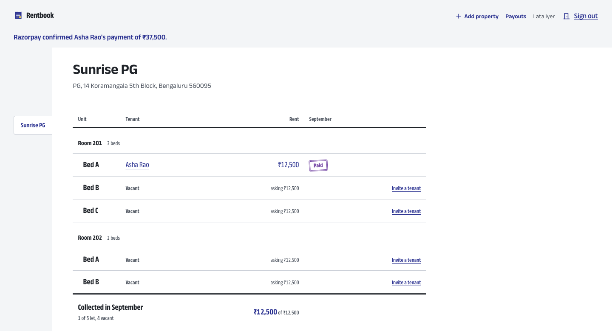
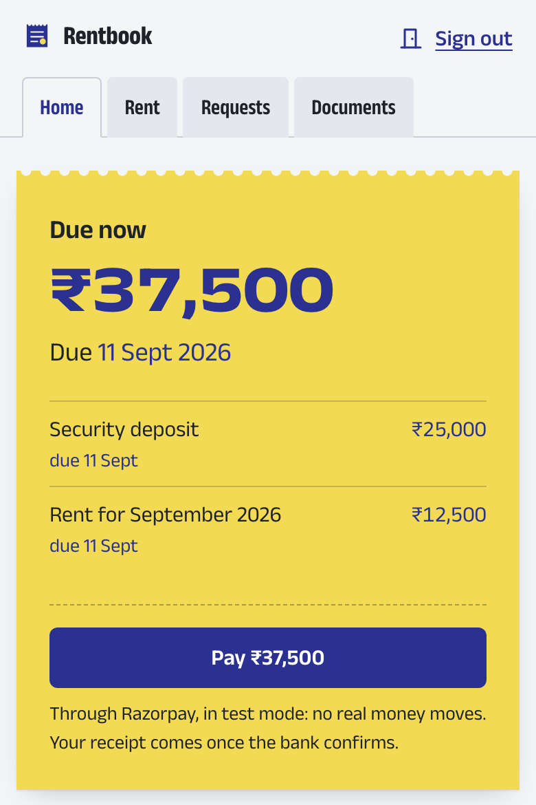
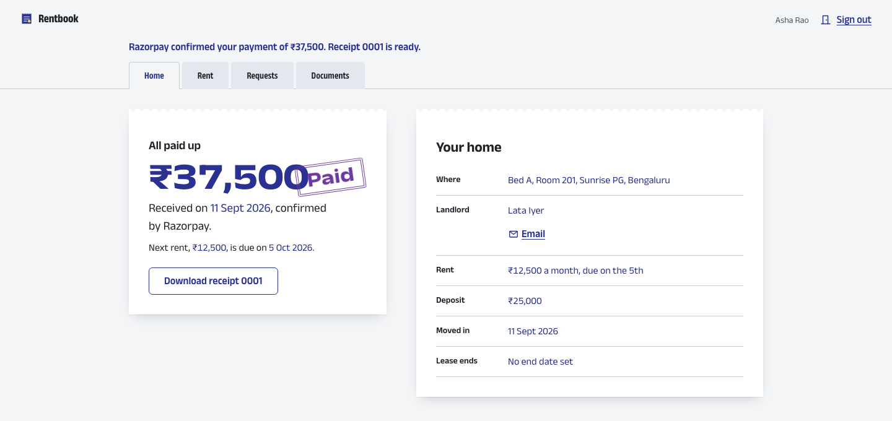
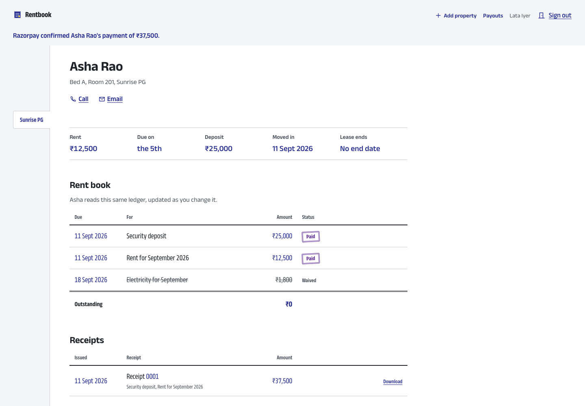
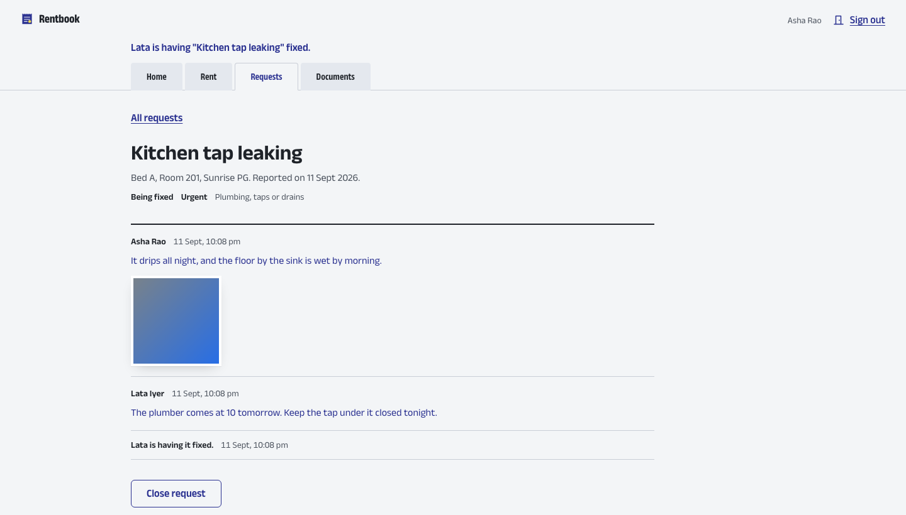
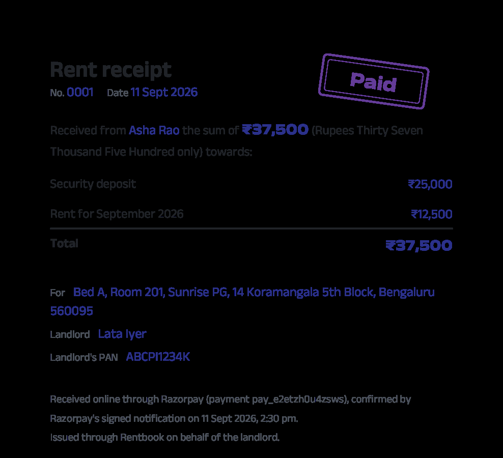
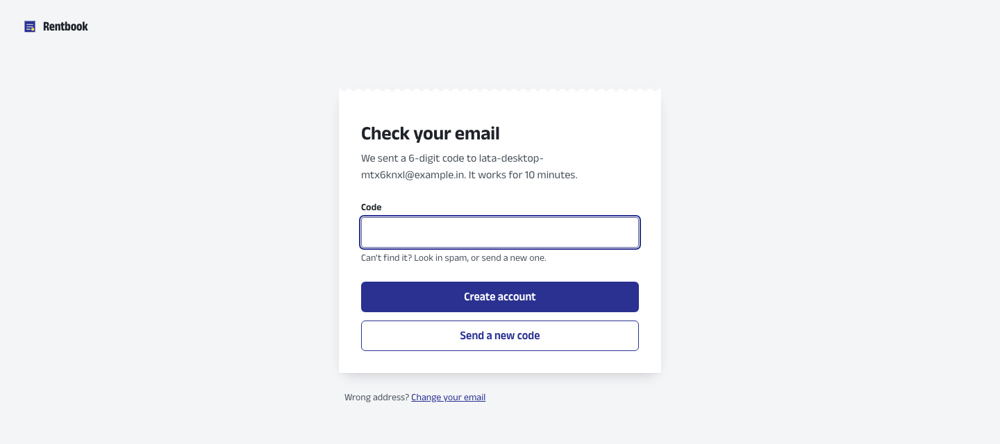

# Rentbook

**A shared rent book for landlords and tenants in India** — for whole flats and single beds in PG rooms.

Landlords and tenants read the *same* records. The lease, the rent ledger and the repair thread are one set of rows, and both screens update live when either person does something. When a tenant pays online, the payment only counts once Razorpay confirms it, and a numbered rent receipt (with the landlord's PAN, for HRA claims) is issued to both sides.

**Live demo:** [rentbook-omega.vercel.app](https://rentbook-omega.vercel.app) — payments run in Razorpay's test mode, so no real money moves. The backend is on a free plan, so the first request after a quiet spell can take up to a minute.



## What it does

### For landlords
- **One register for the whole building.** Properties hold flats, rooms and beds. The first screen answers "who hasn't paid this month?", with a running total of what's been collected.
- **Invite-only tenants.** Invite someone to a bed or flat by email (or share the link on WhatsApp). They sign up from the link, move in, and the landlord's page updates live.
- **Charges and waivers.** Rent is generated every month (never backdated). Deposits, electricity and other charges can be added or waived.
- **Paid directly.** With Razorpay Route, each tenant's payment is split automatically: the landlord's share goes straight to their bank account, and the platform keeps a small fee (2% by default).

### For tenants
- **The rent slip.** The first screen shows exactly what's due, with one button to pay.
- **Receipts.** Every confirmed payment produces a numbered PDF receipt with the amount in words and the landlord's PAN.
- **Repairs.** Report a problem with photos, and follow the landlord's replies on one shared thread.
- **Documents.** The lease agreement, ID proof and anything else, kept per lease and visible only to the two people on it.

### Both, live
Payments, new charges, repair updates and new documents appear on the other person's screen straight away, without a reload. Reminders go out by email (and optionally SMS) before, on and after the due date, never twice.

## Screenshots

| Tenant's rent slip (phone) | After the bank confirms |
|---|---|
|  |  |

**The shared ledger** — the landlord's view of one tenant. The tenant reads the same rows.



| Repair requests | Rent receipt (PDF) |
|---|---|
|  |  |

**Signing up** — landlords confirm their email with a 6-digit code before the account is created.



## How payments stay honest

1. The tenant picks what to pay. The backend creates a Razorpay order with a **transfer** to the landlord's linked account for their share.
2. Razorpay Checkout opens in the browser. When it finishes, the page only says **"waiting for the bank"** — the browser's word is never enough.
3. Razorpay's **signed webhook** is what marks the charges paid. The signature is checked against the raw request body, every event is processed once, and the amount and currency must match the order.
4. After that commits, the receipt PDF is generated, and the Paid stamp lands on both screens at once.

While a payment waits for confirmation, the tenant can't pay the same charges a second time.

## Stack

| Part | Built with |
|---|---|
| Backend | Java 21, Spring Boot 4.1, Spring Security 7 (JWT, two roles), Spring Data JPA, Flyway, STOMP over WebSocket |
| Database | PostgreSQL |
| Frontend | React 19, TypeScript, Vite, React Router, TanStack Query, React Hook Form + Zod |
| Payments | Razorpay Route (test mode) |
| Files | S3-compatible storage (Cloudflare R2 in production, MinIO locally), with presigned uploads |
| Email / SMS | SMTP (Brevo in production, Mailpit locally), optional Twilio |
| Receipts | OpenPDF |
| Hosting | Render (backend), Neon (Postgres), Vercel (frontend) |

## Security

- Short-lived access tokens (15 minutes) and rotating refresh tokens in an httpOnly cookie; reusing an old refresh token signs that session out everywhere.
- Only landlords can sign up, and only after confirming their email with a code. Tenants exist only through an invite, and the role always comes from the invite.
- Someone else's lease, request or document answers **404**, not 403, so IDs can't be probed. Live-update subscriptions are checked the same way.
- Login and signup are rate-limited. Uploads are type- and size-checked, and confirmed in storage before they attach.
- Secrets live in environment variables only; the Razorpay key secret never reaches the browser.

## Project layout

```
backend/       Spring Boot service, organized by feature under com.rentbook
frontend/      React app: landlord screens in src/landlord, tenant screens in src/tenant
docs/          architecture.md (packages, data model, API), deployment.md, screenshots
compose.yaml   local Postgres, MinIO and Mailpit
render.yaml    Render blueprint for the backend
```

The design of each part — data model, REST API, live events, payment flow — is in [docs/architecture.md](docs/architecture.md). Deploying your own copy is covered step by step in [docs/deployment.md](docs/deployment.md).

## Run it locally

You need JDK 21, Node 24 and Docker (Docker Desktop or OrbStack). On macOS with Homebrew's JDK, point Maven at it: `export JAVA_HOME=/opt/homebrew/opt/openjdk@21`.

```sh
# Backend: the dev profile starts Postgres, MinIO and Mailpit from compose.yaml on first run
cd backend
./mvnw spring-boot:run -Dspring-boot.run.profiles=dev

# Frontend, in another terminal
cd frontend
npm install
npm run dev
```

- App: http://localhost:5173 (Vite proxies `/api` and `/ws` to the backend on port 8080)
- API docs (dev only): http://localhost:8080/swagger-ui.html
- Emails, including invites and signup codes: http://localhost:8025 (Mailpit)

On your own machine the signup code is always `000000`.

For online payments, copy `.env.example` to `.env` at the repo root and add your Razorpay **test** keys. The dev profile reads it, and Docker Compose passes it to the backend container. `.env` is gitignored, and the frontend needs no Razorpay variable: the browser gets the key id from the server with each order.

To run everything in containers instead: `docker compose --profile app up --build`.

<details>
<summary>Running without Docker</summary>

Point the backend at any Postgres 17:

```sh
./mvnw spring-boot:run -Dspring-boot.run.profiles=dev -Dspring-boot.run.arguments="\
  --spring.docker.compose.enabled=false \
  --spring.datasource.url=jdbc:postgresql://localhost:5432/rentbook \
  --spring.datasource.username=rentbook --spring.datasource.password=rentbook"
```

Emails then fail to send (there is no Mailpit), which the backend logs. The invite page still shows the link to copy, and signing up still works with the code `000000`.

Photo and document uploads need S3-compatible storage. Run the MinIO binary:

```sh
MINIO_ROOT_USER=rentbook MINIO_ROOT_PASSWORD=rentbook-secret MINIO_API_CORS_ALLOW_ORIGIN=http://localhost:5173 \
  minio server ./minio-data --address 127.0.0.1:9000
```

Then add `--rentbook.storage.endpoint=http://127.0.0.1:9000` to the backend arguments. The dev profile creates the bucket.

</details>

## Tests

```sh
cd backend && ./mvnw verify     # unit tests, then integration tests against a real Postgres (Testcontainers)
cd frontend && npm test         # unit tests
cd frontend && npm run build    # type-check and production build
cd frontend && npm run e2e      # the full journey in a browser, at phone and desktop sizes, with accessibility checks
```

The browser journey drives the running app from start to finish:
1. A landlord signs up, adds a PG room with beds, sets up payouts and invites a tenant.
2. The tenant accepts in a second browser, and the landlord's page updates live.
3. The tenant pays through Checkout and waits until a signed webhook confirms the payment.
4. The Paid stamp lands on both screens, the receipt downloads, and the two trade messages and documents.

It never touches the real Razorpay: Playwright starts a stand-in API, and the backend points at it (the exact command is in [frontend/README.md](frontend/README.md)). The first run needs `npx playwright install chromium`.

The integration tests cover, among other things:
- **Security:** every role against every protected endpoint; forged, expired and wrong-issuer tokens; cross-site requests to the cookie endpoints; strangers getting 404 over REST and over live updates.
- **Accounts:** signup codes (wrong, expired, reused, too many tries), refresh-token rotation and reuse detection, login throttling.
- **Rent:** monthly rent generated once and never backdated, charges and waivers, reminders sent exactly once.
- **Payments** (against a WireMock Razorpay): onboarding, the 98% split, forged or duplicate webhooks, wrong amounts, receipts readable only by the lease's two parties.
- **Repairs and documents** (against a WireMock S3): who can see and change what, upload checks, and cleanup of abandoned uploads.

To run the integration tests against an existing Postgres instead of Testcontainers, add `-Drentbook.test.external-db=true -Dspring.datasource.url=jdbc:postgresql://localhost:5432/rentbook_test -Dspring.datasource.username=… -Dspring.datasource.password=…`.

## Design

The look is modelled on the carbon-copy rent receipt book, where one stroke of the pen lands on both sheets at once — just as one record here reaches both people. Labels are printed in graphite; everything someone *entered* (amounts, dates, names) is written in carbon blue; the violet Paid stamp is reserved for what the server has confirmed. The tokens live in [frontend/src/design/tokens.css](frontend/src/design/tokens.css).
