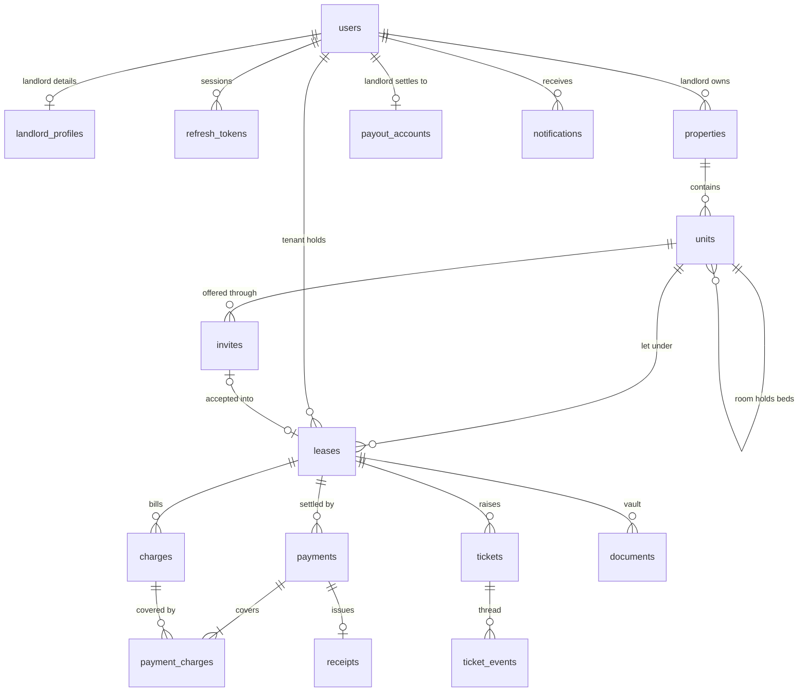

# Rentbook architecture

One platform, two roles (LANDLORD, TENANT), one set of rows. The rent ledger and the maintenance thread are single records that both parties read; nothing is copied per role.

## Repository layout

```
rentbook/
  PRODUCT.md            product truth (impeccable)
  DESIGN.md             visual system, written after the first UI build
  compose.yaml          local infrastructure: postgres, minio, mailpit (+ "app" profile)
  render.yaml           Render blueprint for the backend and Postgres
  docs/                 this file and deployment.md
  backend/              Spring Boot 4.1, Java 21, Maven
  frontend/             Vite, React, TypeScript
```

## Backend

Spring Boot 4.1 (Spring Framework 7, Spring Security 7, Hibernate 7, Jackson 3) on Java 21. Code is organized by feature under `com.rentbook`:

| Package | Responsibility |
|---|---|
| `common` | `BaseEntity` (UUID id, timestamps, optimistic version), `Money` (long paise), RFC 9457 problem responses, paging |
| `config` | security, WebSocket, CORS, typed `rentbook.*` properties |
| `auth` | login, landlord registration, refresh-token rotation, JWT issuing, login throttling |
| `user` | users, landlord profile (display name, optional PAN for HRA receipts, platform fee), `/me` |
| `property` | properties and units (flat, room, bed), ownership checks (`AccessPolicy`) |
| `invite` | invite lifecycle (create, resend, revoke, accept) |
| `lease` | leases created from accepted invites |
| `ledger` | charges, the merged ledger view, monthly rent generation, reminders |
| `payment` | Razorpay Route onboarding, checkout, client callback, webhook and its idempotency log, receipts (per-landlord serials, PDF rendering) |
| `maintenance` | tickets and their append-only event thread |
| `document` | vault metadata, S3 presigned upload and download |
| `notification` | email (SMTP: Mailpit or Brevo) and SMS (log or Twilio) adapters, delivery log |
| `realtime` | STOMP authentication, subscription authorization, live event publishing |

Conventions:
- Money is `bigint` paise in the database and `long` in Java. No floating point.
- DTOs are Java records. No Lombok.
- Side effects (STOMP pushes, email and SMS, receipt PDFs) run in `@TransactionalEventListener(phase = AFTER_COMMIT)` handlers, so nothing leaves the system for a write that rolled back.
- Resources outside the caller's tenancy answer 404, not 403, so IDs can't be probed.
- JWTs are issued and verified with Nimbus (bundled with the resource-server starter). There is no JJWT dependency: its Jackson module targets Jackson 2, and Boot 4 uses Jackson 3.

## Data model

Flyway owns the schema. `V1__core.sql` covers identity, portfolio, invites, and leases. `V2__ledger_notifications.sql` adds charges and the notification log. `V3__payments.sql` adds payout accounts, payments with the charges they cover, receipts, and the webhook log. `V4__maintenance_documents.sql` adds maintenance requests, their append-only thread, and the documents table, which holds maintenance photos now and the vault's files next.



| Table | Key columns | Constraints |
|---|---|---|
| `users` | role LANDLORD or TENANT, full_name, email, phone (E.164), password_hash, status | unique lower(email) |
| `landlord_profiles` | user_id, display_name, pan, platform_fee_bps (default 200) | one per landlord |
| `refresh_tokens` | user_id, token_hash, family_id, expires_at, revoked_at, replaced_by_id | unique token_hash |
| `properties` | landlord_id, name, kind PG, APARTMENT or HOUSE, address, city, pincode | |
| `units` | property_id, parent_unit_id, kind FLAT, ROOM or BED, label, default rent and deposit, status | beds must sit inside a room of the same property |
| `invites` | landlord_id, unit_id, tenant name, email, phone, token_hash, rent, deposit, due_day, dates, status, expires_at | one PENDING invite per unit |
| `leases` | unit_id, landlord_id, tenant_id, invite_id, rent, deposit, due_day 1 to 28, dates, status | one ACTIVE lease per unit |
| `charges` | lease_id, kind RENT, DEPOSIT, UTILITY or OTHER, period_month, amount, due_on, status | one RENT charge per lease per month |
| `payments` | lease, tenant, landlord, amount, platform fee, landlord share, Razorpay order, payment and transfer ids, status | unique Razorpay ids |
| `payment_charges` | payment_id, charge_id | composite key |
| `payout_accounts` | landlord_id, Razorpay account, stakeholder and product ids, activation_status, bank details (last 4 only) | one per landlord |
| `receipts` | payment_id, landlord_id, serial_no, document_id | unique payment_id; serial unique per landlord |
| `webhook_events` | event_id (`x-razorpay-event-id`), type, payload (jsonb), status, error | unique event_id |
| `tickets` | lease, unit, landlord, tenant, title, category, priority, status | |
| `ticket_events` | ticket_id, author_id, kind MESSAGE or STATUS_CHANGE, body, from and to status | append-only |
| `documents` | landlord, lease, ticket event, uploader, type, visibility, storage key, content type, size, status | |
| `notifications` | user, channel, template, dedupe_key, status, provider id | unique dedupe_key |

Vault visibility: lease agreements, receipts, and maintenance photos are visible to both parties of the lease. KYC is visible to the uploading tenant and that lease's landlord only. For other documents the uploader picks landlord-only or both parties.

## REST API

Base path `/api/v1`. Errors are `application/problem+json`. Lists are paged (`page`, `size`).

| Area | Endpoints | Access |
|---|---|---|
| Auth | `POST /auth/register/code`, `POST /auth/register`, `POST /auth/login`, `POST /auth/refresh`, `POST /auth/logout`, `GET /me` | register is for landlords only, with the code emailed by register/code |
| Invites by token | `GET /invites/{token}`, `POST /invites/{token}/accept` | public, token-gated; accepting creates the TENANT user and the lease |
| Invites | `POST /units/{id}/invites`, `GET /invites`, `POST /invites/{id}/resend`, `POST /invites/{id}/revoke` | landlord |
| Portfolio | `GET, POST /properties`, `GET, PATCH /properties/{id}`, `GET, POST /properties/{id}/units`, `PATCH /units/{id}` | landlord |
| Leases | `GET /leases`, `GET /leases/{id}`, `POST /leases/{id}/end` | landlord; tenant reads their own |
| Ledger | `GET /leases/{id}/ledger`, `POST /leases/{id}/charges`, `POST /charges/{id}/waive` | both read; landlord writes |
| Payments | `POST /payments/checkout`, `POST /payments/{id}/client-callback`, `GET /payments/{id}` | tenant |
| Payouts | `GET /payouts/account`, `POST /payouts/account` | landlord |
| Webhook | `POST /webhooks/razorpay` | Razorpay, HMAC-verified |
| Receipts | `GET /leases/{id}/receipts`, `GET /receipts/{id}/pdf` | both parties |
| Maintenance | `GET /tickets?propertyId=&open=`, `POST /tickets` (tenant), `GET /tickets/{id}` (the thread), `POST /tickets/{id}/events`, `PATCH /tickets/{id}/status` | both, scoped; the landlord moves a request forward, the tenant closes or reopens it |
| Uploads | `POST /uploads` (presigned PUT), `POST /documents/{id}/complete`, `GET /documents/{id}/download` | lease parties, visibility-gated |
| Vault | `GET /leases/{id}/documents`, `DELETE /documents/{id}` | lease parties, visibility-gated; only the filer removes a document |
| Dashboards | `GET /dashboard/landlord?month=`, `GET /dashboard/tenant` | per role |

## Real-time

STOMP over a native WebSocket at `/ws` (no SockJS). The client sends `Authorization: Bearer <access token>` in the CONNECT frame, and `StompAuthInterceptor` verifies it with the same decoder as the REST API. Clients only listen: SEND frames are refused, and SUBSCRIBE is allowed only to the destinations below.

| Destination | Carries | Who may subscribe |
|---|---|---|
| `/topic/leases/{id}` | charge added, payment confirmed | the lease's landlord and tenant |
| `/topic/tickets/{id}` | new message, status change | the ticket's landlord and tenant |
| `/user/queue/events` | personal notices: invite accepted, payment confirmed (to the landlord, with the tenant's name), payment failed (to the tenant), new ticket | the user |

## Security

- Access token: HS256 JWT, 15 minutes, claims `sub`, `role`, `name`, `iss`. The `role` claim maps to `ROLE_LANDLORD` or `ROLE_TENANT`. Stateless sessions.
- Refresh token: 256 random bits, stored as a SHA-256 hash, delivered as an httpOnly, Secure, SameSite=Lax cookie scoped to `/api/v1/auth`, valid for 30 days, rotated on every use. Presenting an already-rotated token revokes its whole family. The cookie endpoints also check the `Origin` header.
- Tenant accounts exist only through invite acceptance, and the role comes from the invite, never from the request body. Invite tokens are 32 random bytes, stored hashed, single use, and expire after 7 days.
- Authorization: public endpoints are listed explicitly; role checks use `@PreAuthorize`; ownership is enforced inside queries through `AccessPolicy`.
- WebSocket: CONNECT is authenticated with the same JWT decoder, and every SUBSCRIBE is checked against lease or ticket membership.
- A landlord account needs a 6-digit code emailed to its address first (`POST /auth/register/code`), so every landlord owns the inbox their invites and receipts go to. One code per address, stored as an HMAC keyed with the JWT secret; it lasts 10 minutes, allows five wrong tries, can be re-sent once a minute, and is used up by the account it creates. The dev profile fixes the code at `000000` for the e2e journey; the prod profile refuses to start with a fixed code.
- Passwords use the delegating encoder (bcrypt). Login attempts are throttled per IP address and email.

## Ledger and reminders

- One ledger per lease, read by both parties through `GET /leases/{id}/ledger`. Charges are never deleted: a charge is settled by a verified payment or waived by the landlord.
- Rent is one charge per month. It appears 10 days before it falls due, on the lease's due day, or on the move-in date in the first month when that comes later.
- Rent is never backdated. Months whose due date falls before the lease was recorded in Rentbook are treated as settled outside it. For the same reason, a deposit charge is created only for a new move-in (start date today or later).
- The landlord adds one-off charges (utilities, other). Rent and deposit are generated only by the system.
- Every change to a ledger is pushed to `/topic/leases/{id}` after commit, so the other party's screen updates without a reload.
- Daily jobs, all in India time: rent generation at 00:30 (and at startup), reminders at 09:00, and leases on notice ending at 00:15.
- Reminders go out three days before, on, and three days after a charge's due date, by email and by SMS when a number is on file. Each is claimed in `notifications` with an insert-on-conflict before sending, so no reminder is sent twice, even across instances or retries.

## Payments (Razorpay Route, test mode)

1. **Onboarding** (`POST /payouts/account`). Each landlord becomes a Route linked account in four calls:
   - `POST /v2/accounts` (type `route`, category `housing`, subcategory `space_rental`);
   - a stakeholder;
   - the `route` product, with `tnc_accepted: true`;
   - the settlement bank account.

   Each step's result is saved before the next call, so a retry after a refusal resumes where it stopped instead of opening a second account. Only the account number's last four digits are stored. A PAN given here is also printed on the landlord's receipts. Tenants can pay online once `activation_status` is `activated`.
2. **Checkout** (`POST /payments/checkout`). The tenant pays the charges on their slip. The backend computes three amounts: the total, the platform fee (`platform_fee_bps`, 2% by default, paid by the landlord) and the landlord's share. It then creates an order with `transfers: [{ account, amount: share, currency: "INR", notes, linked_account_notes, on_hold: false }]`. Razorpay creates the transfer once the order is paid. The fee, less Razorpay's gateway fee, stays with the platform account.
3. **Client callback** (`POST /payments/{id}/client-callback`). The browser posts Checkout's signature. The backend checks HMAC-SHA256 of `order_id|payment_id` with the key secret and moves the payment to `AWAITING_WEBHOOK`. Nothing is marked paid here. Razorpay retries a webhook for 24 hours; for that long, a waiting payment blocks a second checkout for the same charges. A tenant who reloads the page therefore cannot pay twice.
4. **Webhook** (`POST /webhooks/razorpay`, public).
   - The `X-Razorpay-Signature` header (HMAC-SHA256 of the raw body with the webhook secret) is compared in constant time, before the body is parsed.
   - Each delivery is claimed once by `x-razorpay-event-id` in `webhook_events`. If applying it fails, the claim is released so that Razorpay's retry gets another go.
   - `order.paid` and `payment.captured` both confirm a payment, in either order. The payment row is locked by order id and its amount and currency are checked against the order. Then one transaction marks the payment captured and its charges paid, and issues the receipt.
   - A confirmation for the wrong amount is ignored and logged for reconciliation by hand.
   - `payment.failed` marks the payment failed, and `transfer.*` events record the transfer's status.
5. **After commit.** Both parties get `payment.confirmed` on `/topic/leases/{id}`. The landlord also gets it on `/user/queue/events`, with the tenant's name, so the register flips on whichever page is open. The tenant is emailed the receipt number.

**Receipts.**
- **Numbering:** per landlord, from a counter on `landlord_profiles` that is incremented under its row lock in the confirming transaction.
- **PDF:** `GET /receipts/{id}/pdf` renders it from the record with OpenPDF on every request, so there is no file to store and it cannot go stale. It carries the number and date, the tenant, the landlord and their PAN, the home, each charge, the total in figures and in Indian words ("Rupees Thirty Seven Thousand Five Hundred only"), and the Razorpay payment id.
- **Access:** only the lease's two parties can read a receipt; anyone else gets 404.

**Local and test runs.**
- Without Razorpay keys, online payments are off and the tenant's slip says so.
- `PaymentFlowIT` runs the whole flow against WireMock.
- The browser journey uses a stand-in API (`frontend/e2e/razorpay-stub.mjs`) and a fake Checkout script.
- In the dev profile, `POST /payouts/account/link` attaches a linked account created by hand in the Razorpay test dashboard.

## Maintenance requests

- **Opening one.** A tenant opens a request on their live lease. It carries:
  - a title;
  - a category;
  - how soon it's needed: when you can, this week, or urgent;
  - a description, which becomes the thread's first line;
  - up to six photos.
- **The thread** (`ticket_events`) is append-only. Both parties write on it, and a change of status is written into it as a line of its own. Each line is stamped at least a microsecond after the one before it, so the order never ties.
- **Status rules:**
  - The landlord moves a request forward: seen, being fixed, resolved.
  - The tenant closes it, or reopens it once it's resolved or closed.
  - Any other move answers 409.
  - `GET /tickets/{id}` returns the statuses this reader may choose next, so the UI offers only those.
  - A closed request takes no new messages until the tenant reopens it.
- **Live:** every change goes to `/topic/tickets/{id}` for both parties. It also goes to the other party's `/user/queue/events`, so the landlord's book and the tenant's tabs hear about it on any page.
- **Away from the screen:**
  - the landlord is emailed when a request is opened, and texted too when it's urgent;
  - the tenant is emailed when it's marked resolved.
- **Photos** are documents of type `TICKET_PHOTO` (see below). A photo attaches only once, only to a message on its own lease, only by the person who uploaded it, and only after storage has confirmed it.
- **Landlord's view:** open requests sit under the register on the property's page, as "Needs you", urgent first.

## Document vault

- **The shelf.** Each lease has one, at `GET /leases/{id}/documents`: lease agreements, ID documents and other files, newest first. It leaves out thread photos (they stay in their threads) and receipts (they're on the Rent tab).
- **Who files what.** The landlord files the lease agreement. The tenant files their own ID (KYC). Either party may file anything else. Only Rentbook issues receipts.
- **Who sees what.** Everything is shared by the lease's two parties, with one exception: an "other" file the landlord marks as their own (`LANDLORD_ONLY`). Nobody outside the lease can list a file, download it, or learn it exists; they get 404.
- **Removal.** Only the person who filed a document may remove it (`DELETE /documents/{id}`). A photo that belongs to a thread can't be removed, because the thread is kept as written. The object leaves storage after the row's deletion commits.
- **Live.** When a shared file is confirmed, both open copies of the lease refresh, and the other party sees who filed what: "Lata filed the lease agreement: lease-agreement.pdf."

## Operational safeguards

- **Account creation is throttled per client address:** 20 an hour by default (`rentbook.auth.signups-per-hour`). That covers signup codes (every landlord registration starts with one, and counting them also stops the endpoint flooding someone's inbox) and invite acceptance, on top of the login throttle. Counts are kept in memory, which suits the single instance the blueprint runs; more instances would need a shared store.
- **Nightly jobs** (India time):
  - 03:45: uploads that were never confirmed within a day are removed from the database and from storage;
  - 04:15: expired refresh tokens are deleted.
- **Lazy screens:** the frontend loads each screen behind the role gates on first visit, so a tenant never downloads the landlord's screens.
- **Security headers:** Vercel sends
  - `nosniff`;
  - a strict referrer policy;
  - `X-Frame-Options: DENY`;
  - HSTS;
  - a report-only Content-Security-Policy that allows Razorpay Checkout, the Render API and R2.

  The API adds Spring Security's own headers. [deployment.md](deployment.md) explains how to make the CSP enforcing.

## Storage and notifications

- **Storage:** S3-compatible, through AWS SDK v2. MinIO locally, where the dev profile creates the bucket; Cloudflare R2 or AWS S3 in production. The bucket stays private. `rentbook.storage.public-endpoint` covers the case where browsers reach storage at a different address from the server, as with MinIO inside Docker Compose.
- **Upload, in three steps.** Nothing the browser says about an upload is trusted; the bucket is checked.
  1. `POST /uploads` checks the lease, the type (JPEG, PNG, WebP or PDF) and the size (up to 10 MB). It records a PENDING document and returns a presigned PUT, valid for 10 minutes, with the content type signed.
  2. The browser sends the file straight to storage.
  3. `POST /documents/{id}/complete` checks the object with a HEAD request before the document becomes AVAILABLE.
- **Downloads:** 5-minute presigned GET URLs, issued only after the visibility check. A thread's photos come with their links; other files come through `GET /documents/{id}/download`.
- **Storage keys:** `leases/{lease}/{document}.{ext}`. The uploader's filename is kept in the row for downloads and never goes into the key.
- Email goes through SMTP: Mailpit locally, Brevo (or any relay) in production; SMS through a logging adapter locally or Twilio. Rent reminders go out three days before, on, and three days after the due day, deduplicated by `notifications.dedupe_key`.
